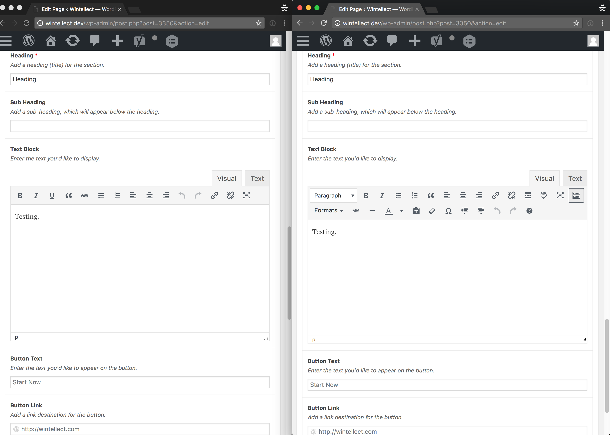

If you notice that a site has Advanced Custom Fields wysiwyg toolbar buttons missing, it is likely because the `Basic` toolbar is being displayed rather than the `Full` toolbar. I was able to fix that issue and get them to show the Full toolbar by implementing the filter below.

`gist:ab93e7edab148bdbcd9bf3ada9525883`

This function removes the Basic toolbar from the array of available toolbars available to ACF wysiwyg fields, so the remaining Full toolbar is used instead. Here’s a before and after screenshot illustrating what it does:

