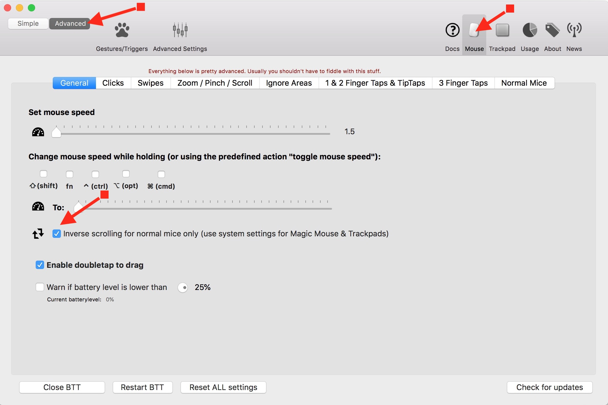
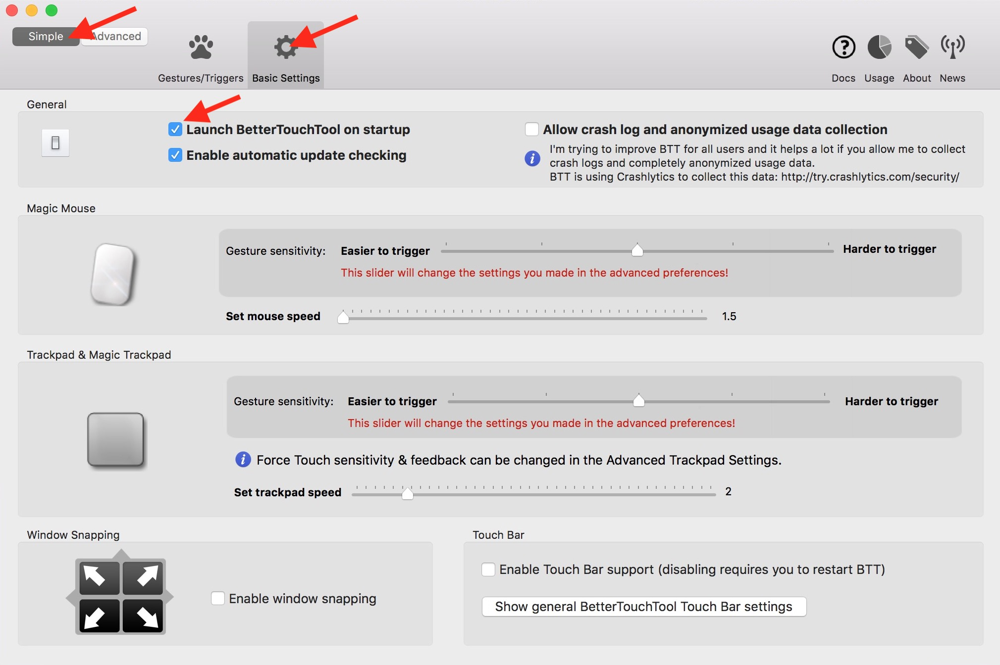

When using the trackpad on your computer, Apple’s “natural” scrolling feature is pretty great. The content moves in the same direction as your gestures, just as it does on tablets and smartphones.

In my opinion, it makes far less sense to use natural scrolling when using a mouse, though. Scrolling the scroll wheel down makes the page move up, and scrolling up makes the page move down – it’s a bit counterintuitive to say the least. You can turn natural scrolling on or off in `System Preferences` → `Mouse` or `System Preferences` → `Trackpad` by selecting `Scroll direction: natural`, but doing so will change the scroll direction for *both* devices. So if you want to use natural scrolling for your trackpad but not for your mouse, you’ll have to go into System Preferences every time you switch between devices and manually toggle the feature on or off. Frustrating! Below I’ll outline how to make it so that Natural Scrolling will be always on for your trackpad, and always off for any mouse you connect.

1. Purchase a copy of BetterTouchTool. At the time of this writing, the standard license only costs $6.50 USD.
1. Download the install the app
1. Open it and go to `Advanced` tab → `Mouse` → `General`, then check the box next to `Inverse scrolling for normal mice only`
1. After that, go to `Simple` tab → `Basic Settings` → `Launch BetterTouchTool on startup` to make sure the app is always running in the background.

