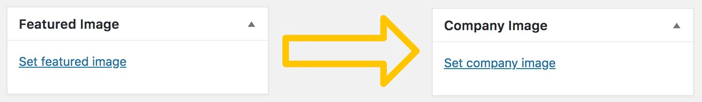

## Update for WordPress 4.3+

As of WordPress 4.3, you can set the `Featured Image`, `Set featured image`,  `Remove featured image` and `Use as featured image` labels to whatever custom text you’d like to use instead. You can do this when the post type is registered using `register_post_type()`.

Here’s an example of how to to it:

`gist:7454c8f897b49639d4a7fb944bf80797`

Further documentation is here:  
<https://developer.wordpress.org/reference/functions/register_post_type/>

---

## WordPress <4.3

For sites running a version of WordPress lower than 4.3, here’s how to change/filter the featured image metabox title and link text in WordPress:

`gist:25d51a2ebee4ca3b066598ba1e6d47a6`

To use this code, just make these changes:

Change `my_post_type_name` to the name of the post type for which you want to change the featured image text.
Change `NEW TITLE TEXT`, `NEW SET TEXT HERE` and `NEW REMOVE TEXT HERE` to the new text you want to use.
Change `km` to the function prefix & text domain of your choice.
 
Note: The default `Remove featured image` text is still visible immediately after an image is selected. The code above does not address that.