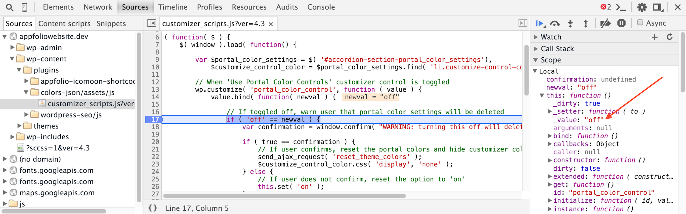

Since the WordPress Customizer is built using the [Underscore.js](http://underscorejs.org/) and [Backbone.js](http://backbonejs.org/) libraries, the values of all the customizer controls are not stored in the DOM, but rather in a discrete model. This means that if you use JavaScript to change the value of a control in the DOM, it will look like it has changed visually, but that value will not be saved. Underscore has two-way data binding, so if you update the value in the model (which is what WILL be saved when the user clicks `Save and Publish`), it will also be updated visually in the DOM.

In order to change the value of a control, you need to bind a JavaScript function to it (see lines 5 & 6 of the code below), then use Backbone’s `.set()` method to save a new value for it (see line 16).

`gist:ea03d6be587947a864e7`

The example above is for on/off radio buttons. If the user clicks the `off` radio button, they see a JavaScript confirm box pop up telling them that if they turn it off, some of their settings will be deleted. If they click `Cancel`, the radio button control is automatically changed back to the `on` value.

## Debugging

To help you determine what the value of a customizer control is at a given point, you can:

1. Open the Sources tab of Chrome’s dev tools.
1. Find the JavaScript file.
1. Click in the margin to set a breakpoint right after `value.bind()`.
1. Click the Scope dropdown in the right pane and view the value of this (the customizer control you bound the current function to).
1. You can also set another break point after your `this.set()` code to make sure the value has been successfully changed.

## Enqueue Your JS

And of course, don’t forget to enqueue your JavaScript file with code similar to this:

`gist:a4dcc88a42278ea72d9e`