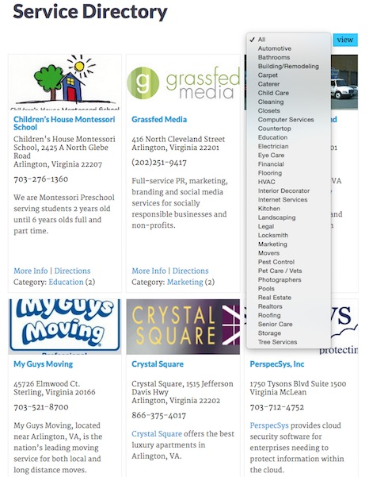

In this post, I'll outline how to create a taxonomy dropdown in WordPress that lets the user choose an option, then reloads the page to only show entries that match the taxonomy term they chose. This is extremely useful for filtering a list of results to show only what your visitor is interesting in seeing.

Let's say we have a custom post type called `tool`, and we've created a custom taxonomy to organize our tools called `tools`. Our `tools` taxonomy has terms such as `hammer`, `nails`, `saw`, etc.

To customize the code below to work for your purposes:

1. Change `tool` to whatever post type you're using -- this could be `post` or `page` (which are both built in to WordPress) or any custom post type.
1. Change `tools` to whatever taxonomy you're using -- this could be `category` or `tag` (which are both built in to WordPress) or any custom taxonomy.
1. Change the `km_` function prefix to something unique.

## functions.php Code

Put this code in functions.php:

`gist:88a0724fd94f254841399dcf879ac2c9`

## Page Template Code

Then put this code in your page template:

`gist:f6de4fb74cb4823dc77fb7bed0f9c501`

## Example

Happy filtering! :)
