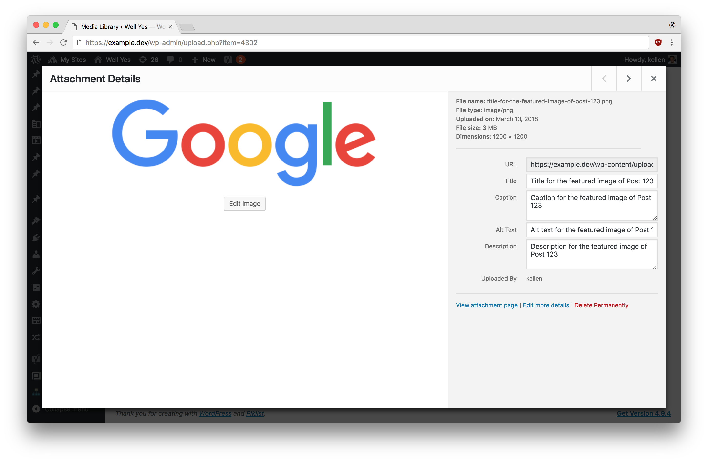

I built the following class that downloads a remote image, moves it into the /uploads/ directory of your site, adds it to WordPress as a new attachment and returns to you the attachment ID. Example usage is shown further down the page.

`gist:2b32de0dd111d344e867cd5c670fb919`

## Example Usage

Below are two examples of how you can use this class to download a remote image and set it as the featured image for a WordPress post.

`gist:c0d53a427d2366ed2eee39d4abadd704`

The image that was downloaded in example 2 looks like this in the Media Library:

