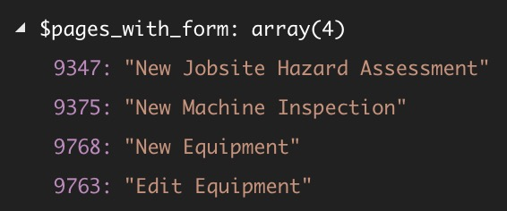

The class below can be used to locate all the pages that contain a specific Gravity Form. It searches the post content of each page. If the `gravityform` shortcode is found and it has the specific `id` that we'€™re looking for, that page is added to the list.

## Example Usage

It can be used like this:

`gist:613df98ee2276ab1eb1c31f28ba19575`

The resulting array looks like this:

The array keys are the pages'€™ post IDs and the values are the pag's’ names. This allows you to quickly tell which pages contain a particular Gravity Form.

## The Class

`gist:143f21976bdc19c66bf8e25d8636f792`
