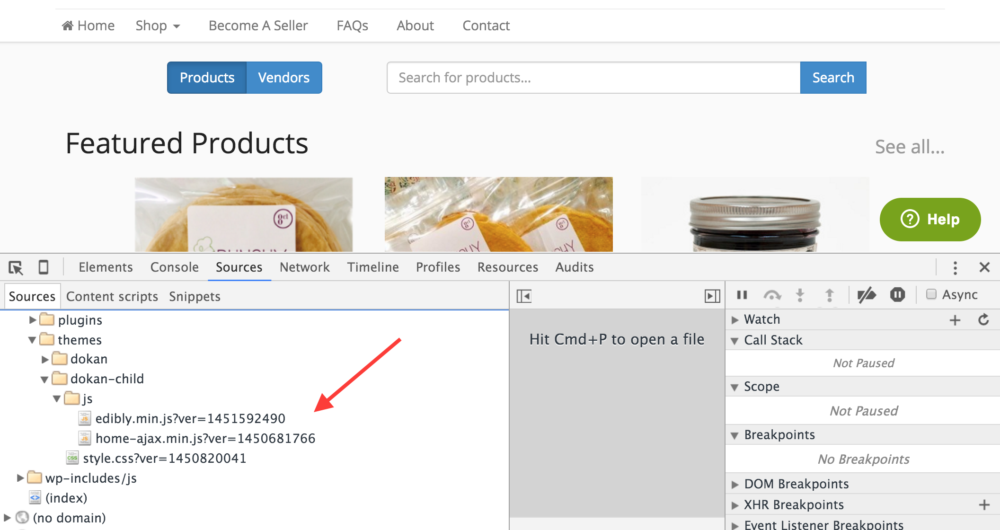
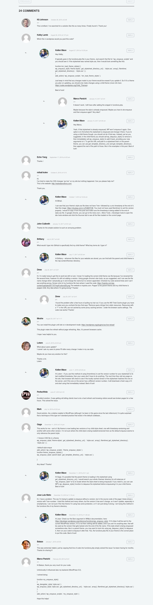

To quote Mark Jaquith's [helpful post](https://markjaquith.wordpress.com/2009/05/04/force-css-changes-to-go-live-immediately/) on this topic:

> If you update your WordPress theme's style.css, you may have noticed that you have to “force-reload” your site in your browser to see the changes. This is because your browser keeps a copy of the CSS cached on your hard drive. Depending on how your server is set up, it may not check for a new version of the stylesheet for a couple hours, or longer! And even if you force-reload to see the changes, visitors who have previously accessed your site may still get the old CSS.

That post is from 2009 and WordPress functions for loading assets have changed a bit since then, so I'll provide an updated solution.

One way to solve this problem is to “version” your CSS file, by enqueueing your stylesheet and appending a timestamp to the end of it that represents when the file was last updated. And the same can be done for JavaScript files, as well. WordPress has a `$ver` parameter built in to the `wp_enqueue_style()` and `wp_enqueue_script()` functions for just such a purpose. Versioning your CSS & JS files looks like this:

`gist:5ce9909d37d37521481b`

This tells WordPress to enqueue the stylesheet/js file just as it normally would, but to append `?ver=` to the end of it, followed by a Unix timestamp representing when the file was last modified (see the image below). This ensures that the version of the file enqueued is the most recent, so everyone instantly sees your changes.

