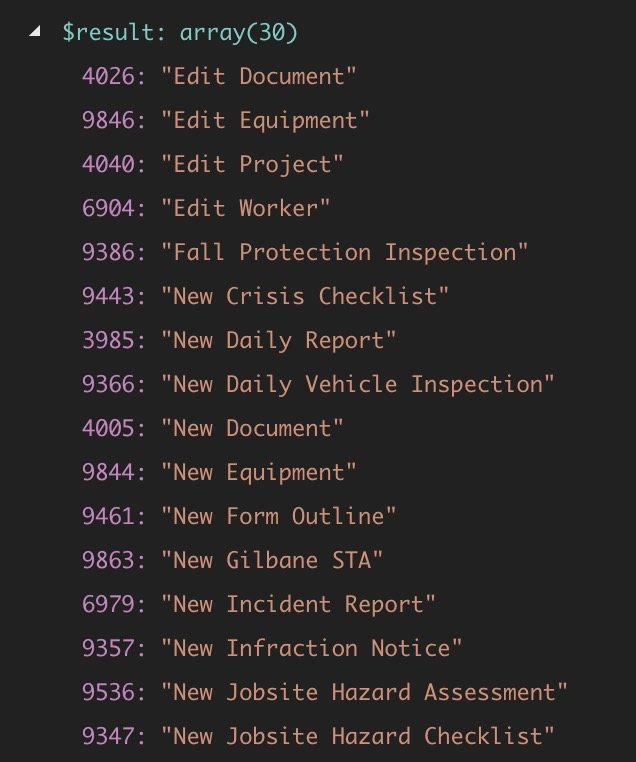

The function below can be used to get a list of all WordPress pages that contain a shortcode.

`gist:cdf60f88e5b07356d992bcdb5439ff25`

You can use it like this: `get_pages_with_shortcode( 'gravityform' )`, replacing `gravityform` with the shortcode you’re interested in searching for. The array it returns look like this, with the post IDs as the keys and the page titles as the values:

