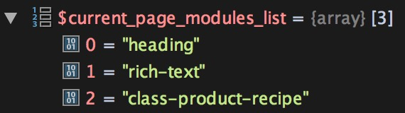

I’ve been doing some work lately with the Beaver Builder page builder for WordPress. For one feature, I needed to get a list of all the Beaver Builder modules that exist on a page. I couldn’t find any native functionality in the plugin to get that data though, so I built the class below to serve that purpose.

## Example Usage

`gist:ec0399884aa77c723ec396a854d37d61`

An example showing the array of data you get back is below. They module types will appear in the list in the same order they appear on the page. So this particular page has a `heading` type module at the top of the page, a `rich-text` module below that, and a `class-product-recipe` module at the bottom.

## The Class

`gist:add5c45e5bddcdd3271de8fc7d204a18`

Happy Beaver Buildering!