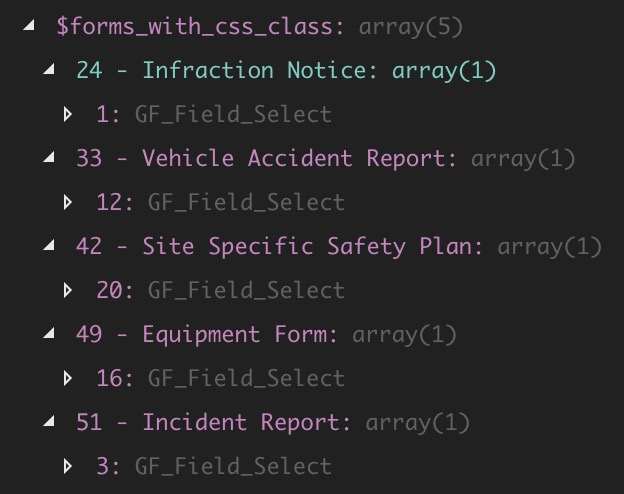

The functions below can be used to get a list of all Gravity Forms whose fields have a specific CSS class:

`gist:d3fa30ccabc4139cebdb56caa501597e`

Calling the first function looks like `get_gravity_forms_with_css_class( 'list-users2' )` and the results it returns look like this:

The keys of the array include the form ID and title. Each value is an array of all the fields within that form that have the CSS class.
