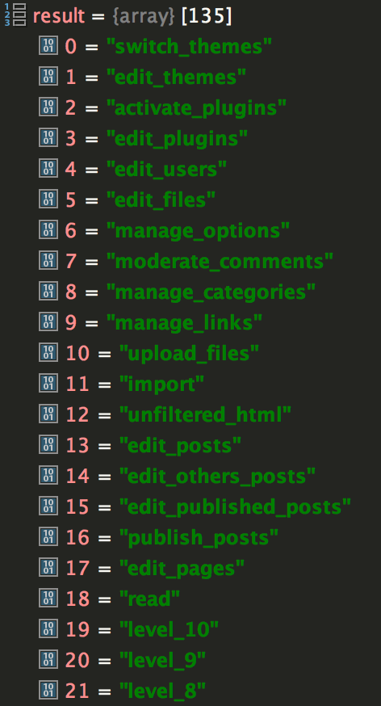

The function below can be used to get all  of a user’s capabilities:

`gist:fc59a52454bad6aa7dedf85ccce223aa`

If you pass a user ID to it, you will get that user’s capabilities. If you don’t pass anything to it, you’ll get the current user’s capabilities instead.

It will return an array of capabilities like the one pictured below, or an empty array if the user has no capabilities or doesn’t exist.

