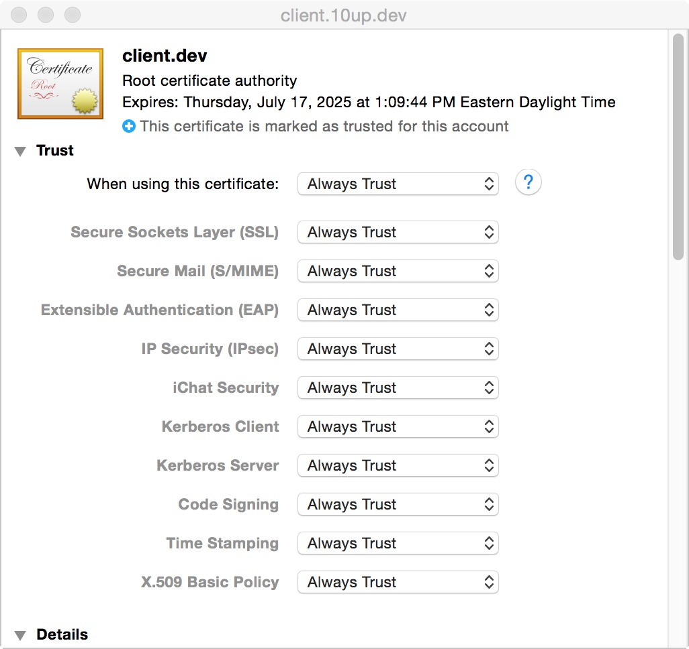

This post covers how to set up a local SSL WordPress site. These instructions assume you’re on a Mac and use Varying Vagrant Vagrants (VVV) for local development.

## Initial Steps
`cd` into the directory where all the `.conf` files are for your local sites.
`cd ~/vagrant-local/config/nginx-config/sites`

Create a new `ssl` directory
`mkdir ssl`

`cd` into the new `ssl` directory
`cd ssl`


## Generate an SSL Key and Certificate

The commands below will create new `example.dev.key` and `example.dev.cert` files. Replace `example.dev` with your development site domain.

```
openssl genrsa -out example.dev.key 2048
openssl req -new -x509 -key example.dev.key -out example.dev.cert -days 3650 -subj /CN=example.dev
```

## Edit `.conf` File

Go up one directory level and open the `.conf` file for the site you want to enable ssl on. Add these lines at the bottom, before the `server {…}` closing curly brace. Again, replace `example.dev` with your development site domain.

```
ssl on;
ssl_certificate /srv/config/nginx-config/sites/ssl/example.dev.cert;
ssl_certificate_key /srv/config/nginx-config/sites/ssl/example.dev.key;
```

## Set Cert as Trusted

Open the “Keychain Access” application, in `Finder` > `Applications` > `Utilities`.
Drag and drop the cert file into the application window.
Search to find the cert you just added, double-click to open it and change to `Always Trust`.



## Provision Vagrant

Run this to provision your Vagrant virtual machine and ensure you updated the .conf file correctly.

`vagrant provision`

## Done!

Now you can convert your WordPress site to SSL, if you haven’t done so already.

When visiting the site, you will get a warning message similar to “This site’s security certificate is not trusted!”, which is is expected. The browser’s telling you that it cannot verify the identity of the server you are trying to connect to because it isn’t signed by a trusted SSL certificate authority. Since we created a self-signed certificate, this makes sense. Just click “Proceed anyway”, “Continue”, or whatever similar option is available and you’ll see the site. Also ignore the “https” in the address bar that is highlighted in red, or with a strikethrough to indicate the untrusted certificate – that’s not a problem.

## Resources

Useful VVV-specific guide:  
<https://github.com/Varying-Vagrant-Vagrants/VVV/wiki/Site-specific-self-signed-SSL-certificates>

Another very comprehensive article DART Creations has written on setting up SSL on WordPress sites in gereral (not just locally on VVV):  
<https://www.dart-creations.com/wordpress/wordpress-tutorials/wordpress-ssl.html>