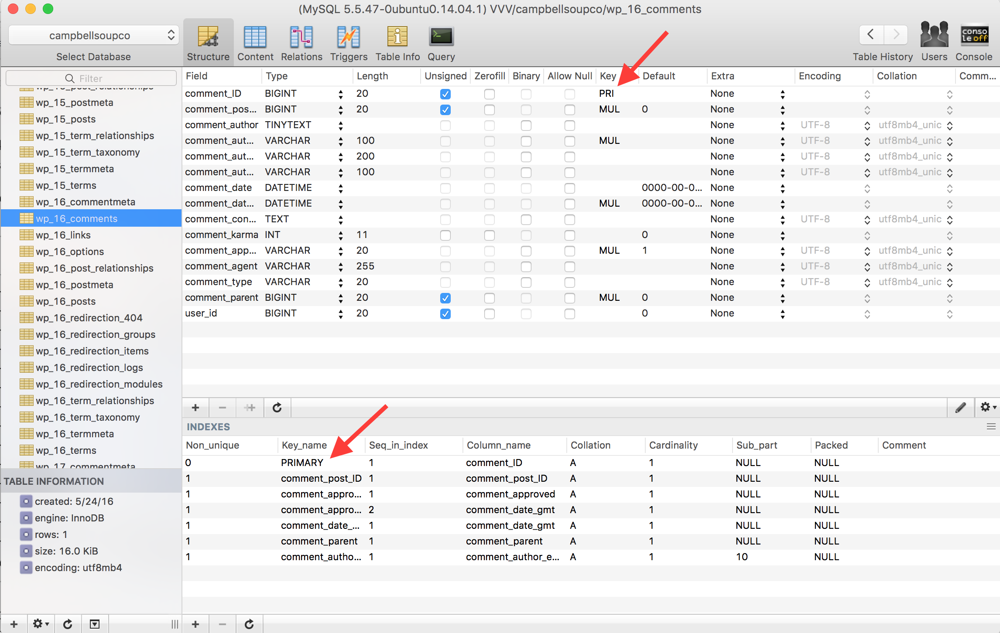

[WP-CLI](https://wp-cli.org/)‘s `search-replace` command is invaluable for changing all the URLs from a production or staging site to reflect your local development environment, among other things. Today I encountered something I hadn’t before; when running a `search-replace` on a database that I had already imported for local development, WP-CLI updated some of the database tables, but others were skipped, according to its output:

```
$ wp search-replace --url=example.com example.com example.dev 'wp_*_options'

+---------------+--------------+--------------+------+
| Table         | Column       | Replacements | Type |
+---------------+--------------+--------------+------+
| wp_15_options | option_name  | 0            | SQL  |
| wp_15_options | option_value | 5            | PHP  |
| wp_15_options | autoload     | 0            | SQL  |
| wp_16_options | option_name  | 0            | SQL  |
| wp_16_options | option_value | 4            | PHP  |
| wp_16_options | autoload     | 0            | SQL  |
| wp_17_options |              | skipped      |      |
| wp_18_options |              | skipped      |      |
| wp_20_options |              | skipped      |      |
| wp_27_options |              | skipped      |      |
+---------------+--------------+--------------+------+
Success: Made 9 replacements.
```

## TL;DR

Most likely, an error occurred when you exported/imported the database and some of the index data is missing. Try getting another copy of the database to import, then running the search-replace again.

## Explanation

One of the keys in each database table has to be marked as the primary key, or else WP-CLI will skip over it and output `skipped` as shown above. To see if that’s your problem, use [DESCRIBE](https://db.apache.org/derby/docs/10.3/tools/rtoolsijcomrefdescribe.html) to view the index data for one of the skipped tables, like this:

```
$ wp db query 'DESCRIBE wp_17_comments'

+----------------------+---------------------+------+-----+---------------------+-------+
| Field                | Type                | Null | Key | Default             | Extra |
+----------------------+---------------------+------+-----+---------------------+-------+
| comment_ID           | bigint(20) unsigned | NO   |     | NULL                |       |
| comment_post_ID      | bigint(20) unsigned | NO   |     | 0                   |       |
| comment_author       | tinytext            | NO   |     | NULL                |       |
| comment_author_email | varchar(100)        | NO   |     |                     |       |
| comment_author_url   | varchar(200)        | NO   |     |                     |       |
| comment_author_IP    | varchar(100)        | NO   |     |                     |       |
| comment_date         | datetime            | NO   |     | 0000-00-00 00:00:00 |       |
| comment_date_gmt     | datetime            | NO   |     | 0000-00-00 00:00:00 |       |
| comment_content      | text                | NO   |     | NULL                |       |
| comment_karma        | int(11)             | NO   |     | 0                   |       |
| comment_approved     | varchar(20)         | NO   |     | 1                   |       |
| comment_agent        | varchar(255)        | NO   |     |                     |       |
| comment_type         | varchar(20)         | NO   |     |                     |       |
| comment_parent       | bigint(20) unsigned | NO   |     | 0                   |       |
| user_id              | bigint(20) unsigned | NO   |     | 0                   |       |
+----------------------+---------------------+------+-----+---------------------+-------+
```

`PRI` should be listed in the `Key` column somewhere, but since it isn’t, WP-CLI doesn’t know which is the primary key and is consequently skipping the table. Since the example above is a WordPress comments table, `comment_ID` should have `PRI` in the Key column. By looking at the table index data above (and thanks to help from [@JPry](https://twitter.com/jpry)), I was able to see that my table was missing much more than just the primary key and that an error had occurred when the database was exported/imported. So to fix the issue, I needed to get another copy of it and try the `search-replace` again.

Another way to view this data is to use a tool like [Sequel Pro](http://www.sequelpro.com/). The image below is what a table SHOULD look like – you can see that the primary key and other data is intact:


